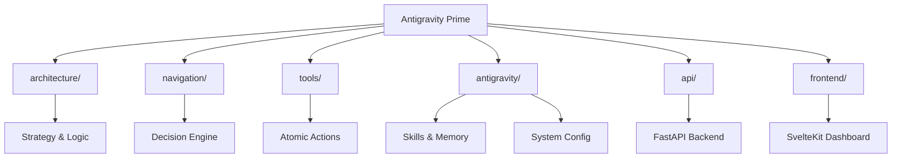

<div align="center">
  <h1>🛸 Antigravity Prime</h1>
  <p>
    <strong>The Official Blueprint for Deterministic Agent Systems</strong>
  </p>
  <p>
    Powered by <strong>B.L.A.S.T. Protocol</strong> & <strong>A.N.T. Architecture</strong>
  </p>
  
  <p>
    <a href="https://github.com/JesterkingLord/Antigravity-Prime-Template/actions"></a>
    <a href="LICENSE"></a>
    <a href="https://www.python.org/"></a>
    <a href="https://svelte.dev/"></a>
    <a href="https://fastapi.tiangolo.com/"></a>
    <a href="https://www.docker.com/"></a>
  </p>
</div>

---

## 📖 Overview
**Antigravity Prime** is a production-ready template for building advanced Agentic AI systems. It is not just a skeleton; it is a fully functional Operating System for agents, featuring a reactive Dashboard, a Memory-Augmented Brain, and a strict 3-Layer Architecture designed for scale.

Whether you are starting a new project or cherry-picking features for an existing one, this template provides the "Antigravity" needed to lift your heavy lifting.

---

## ✨ Key Features

### 🧠 Intelligent Core
*   **Vector Memory**: Built-in `ChromaDB` integration for long-term semantic recall.
*   **Skill Registry**: A centralized JSON brain (`skill_registry.json`) that manages capabilities.
*   **Interactive Chat**: Real-time communication with your agent via SvelteKit frontend.

### 🏗️ A.N.T. Architecture
*   **Layer 1 (Architecture)**: Strategy & SOPs (`architecture/`).
*   **Layer 2 (Navigation)**: Routing & Decisions (`navigation/`).
*   **Layer 3 (Tools)**: Deterministic Execution (`tools/`).

### 🛠️ Developer Experience (DX)
*   **Antigravity CLI**: Unified control with `python antigravity.py`.
*   **Auto-Accept**: VS Code integration for seamless agent operation.
*   **Dockerized**: Ready for cloud deployment with `docker-compose`.
*   **Quality First**: Pre-configured with `ruff` (linting), `pytest` (testing), and GitHub Actions CI.

---

## 🚀 Quick Start

### Prerequisites
*   Python 3.12+
*   Node.js 18+
*   Docker (Optional)

### Option A: The "All-in-One" Command
The CLI handles everything. It checks dependencies, installs them, and launches both backend and frontend.
```bash
python antigravity.py start
```
*   **Dashboard**: [http://localhost:5173](http://localhost:5173)
*   **API Docs**: [http://localhost:8000/docs](http://localhost:8000/docs)

### Option B: Docker (Production Mode)
```bash
python antigravity.py docker
# or
docker-compose up --build
```

---

## 📂 Project Map



See [TEMPLATE_MAP.md](TEMPLATE_MAP.md) for a detailed breakdown.

---

## 🛠️ CLI Reference
The `antigravity.py` tool is your command center.

| Command | Description |
| :--- | :--- |
| `python antigravity.py start` | **Ignition**. Starts API + Frontend servers. |
| `python antigravity.py health` | **Diagnostics**. Checks env, ports, and dependencies. |
| `python antigravity.py new-skill` | **Wizard**. Interactively creates a new skill structure. |
| `python antigravity.py docker` | **Deploy**. Runs the stack in Docker containers. |
| `python antigravity.py test` | **Verify**. Runs the pytest suite. |
| `python antigravity.py lint` | **Polish**. Checks code quality with Ruff. |

---

## 🧩 Adding New Skills
Stop writing boilerplate. Use the wizard:
1.  Run `python antigravity.py new-skill`
2.  Enter Skill Name (e.g., `web-scraper`)
3.  Enter Category (e.g., `tools`)
4.  The system generates:
    *   `SKILL.md` (Logic)
    *   `metadata.json` (Registry Info)
    *   Folder Structure

---

## 🤝 Contributing
We welcome contributions! Please see [CONTRIBUTING.md](CONTRIBUTING.md) for details on the B.L.A.S.T. protocol.

## 📄 License
This project is open-source and available under the [MIT License](LICENSE).
