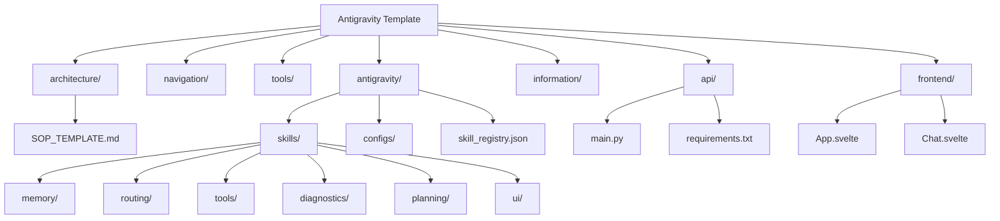

# 🗺️ Template Map

This file provides a visual map of the project structure to help you navigate quickly.

## Quick Links
- **[Start Here](README.md)**
- **[System Architecture](architecture/README.md)**
- **[Skill Registry](antigravity/skill_registry.json)**
- **[Frontend Dashboard](frontend/README.md)**
